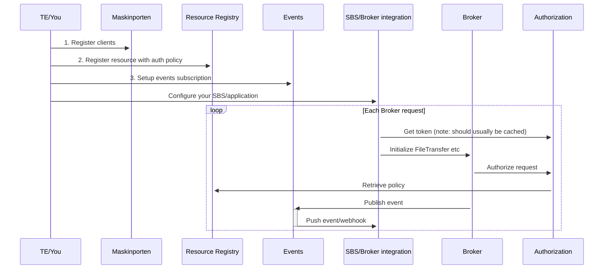

## Get started

For general overview of how the Broker API works with its dependencies and the steps that needs to be taken to configure a system to use the Broker API, see below:

### 1. Register Maskinporten clients for consumers of the API (senders, recipients and service owner)

You need to register Maskinporten clients/integrations that are used to authenticate/"log in" to the Broker API. Each of these clients needs to be given access to scopes according to how they will be used:

* altinn:authorization:pdp - all clients of the broker API requires this scope for now as it provides access to authorization
* altinn:broker.sender - for clients that sends files using the broker API
* altinn:broker.reader - for clients that receives files using the broker API

You can use [Samarbeidsportalen self-service](https://sjolvbetjening.test.samarbeid.digdir.no/) to register clients. [Click here for a comprehensive guide on how to do this](https://docs.digdir.no/docs/Maskinporten/maskinporten_sjolvbetjening_web#selvbetjening-som-api-konsument).

### 2. Register a resource in the resource registry

All files sent using Broker is associated with a resource/service/"tjenesteressurs". These are registered in Altinn Studio, and are used for access rules and access lists.
Your access rules must be configured in such a way that that they permit the actions "publish", "read" and "write". See an example policy in .xml format in Test/Altinn.Broker.Tests/Data/BasePolicy.xml.

To setup a resource that works quickly, you can use our Postman collection and run the requests "Create resource" and "Create resource policy". Note that this policy will authorize neither on access lists nor on system user, and is essentially open for use by anyone with access to the Broker API in general.

**TIP**
Test out your configuration from 1. and 2. by testing with the [Postman collection](../README.md#postman) but using your own tokens instead of the test tokens generated by the requests in the "Authenticator" folder of the collection .

### 3. Setup Events subscription

In order to use events/webhooks for a broker resource, you need to setup a subscription for the given resource. You can also use wildcard to setup a single subscription for many resources. This subscription is used to configure the endpoint where the events published by broker end up. [You can read more about how to setup an Events subscription in Altinn Events here](https://docs.altinn.studio/events/subscribe-to-events/developer-guides/setup-subscription/).

### 4. Integrate your solution to the broker API.

In order to authenticate to the API, use the Maskinporten integration created in step 1 to [retrieve a Maskinporten token](https://docs.digdir.no/docs/Maskinporten/maskinporten_protocol_token) (also see "Login to Maskinporten (Initialize)" in our Postman collection). This token should in turn be used in [a request to Altinn Authentication to retrieve an Altinn Token](https://docs.altinn.studio/authentication/architecture/accesstoken/). The Altinn Token is then added as a Bearer token to every request to the Broker API.

If it is your first time as a service owner using the API, you need to have your cloud infrastructure provisioned first. You can do this by calling POST on /serviceowner (see [OpenAPI spec](../altinn-broker-v1.json)) with your Altinn Token that has an altinn:resourceregistry/resource.write scope. Within a minute or two the infrastructure should be ready for use.
