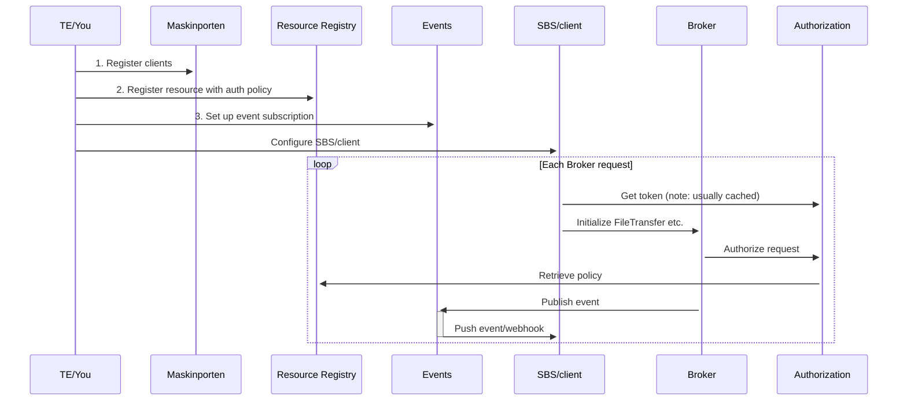

## Getting Started

{}
This guide is being replaced by the User Guides on the Altinn Studio Docs site here: [https://docs.altinn.studio/broker/user-guides/](https://docs.altinn.studio/broker/user-guides/)
{}

To understand how the Broker API operates, including its dependencies and configuration steps, refer to the information below:

### 0. Get an API key

In order to use Altinn API's, you need a subscription key for the API's. This is passed as the header "Ocp-Apim-Subscription-Key" in every request.
You can get it by contacting us at [Altinn@Slack#produkt-formidling](https://join.slack.com/t/altinn/shared_invite/zt-7c77c9si-ZnMFwGNtab1aFdC6H_vwog).

### 1. Register Maskinporten Clients
Register Maskinporten clients to authenticate with the Broker API, assigning them relevant scopes:
- `altinn:broker.write` - For clients sending files.
- `altinn:broker.read` - For clients receiving files.

Use [Samarbeidsportalen self-service](https://sjolvbetjening.test.samarbeid.digdir.no/) for registration. [Here's a detailed guide](https://docs.digdir.no/docs/Maskinporten/maskinporten_sjolvbetjening_web#selvbetjening-som-api-konsument).

### 2. Register a Resource
All files sent using Broker is associated with a resource/service/"tjenesteressurs". These are registered in Altinn Studio, and are used for access rules and access lists.
Your access rules must be configured in such a way that that they permit the actions "publish" (for all), "read" (for recipients) and "write" (for senders). 

To setup a resource that works quickly, you can use our Postman collection and run the requests "Create resource" and "Create resource policy" with a token that has the scope "altinn:resourceregistry/resource.write". See an example policy in .xml format in Test/Altinn.Broker.Tests/Data/BasePolicy.xml. Note that this policy will authorize neither on access lists nor on system user, and is essentially open for use by anyone with access to the Broker API in general.

Alternatively, you can use the GUI in Altinn Studio. 

**TIP**: Verify your configurations from steps 1 and 2 using the [Postman collection](../README.md#postman), substituting the test tokens with your own Altinn tokens (See "Login to Maskinporten (Initialize)" request in Authenticator folder).

### 3. Set Up Event Subscriptions
In order to use events/webhooks for a broker resource, you need to setup a subscription for the given resource. This subscription is used to configure the endpoint where the events published by broker end up. [You can read more about how to setup an Events subscription in Altinn Events here](https://docs.altinn.studio/events/subscribe-to-events/developer-guides/setup-subscription/).

### 4. Integrate with the Broker API
Authenticate using the Maskinporten integration from step 1 to [obtain a Maskinporten token](https://docs.digdir.no/docs/Maskinporten/maskinporten_protocol_token), then acquire an Altinn Token from [Altinn Authentication](https://docs.altinn.studio/authentication/architecture/accesstoken/). Use the Altinn Token as a Bearer token for all Broker API requests along with the APIM subscription key as a header with the key "Ocp-Apim-Subscription-Key".

First-time service owners who want to use Broker need to provision their Altinn Broker-managed cloud infrastructure via POST on /serviceowner with an Altinn Token (see [Postman collection](../altinn-broker-v1.json)). The infrastructure should be operational within a couple of minutes.
